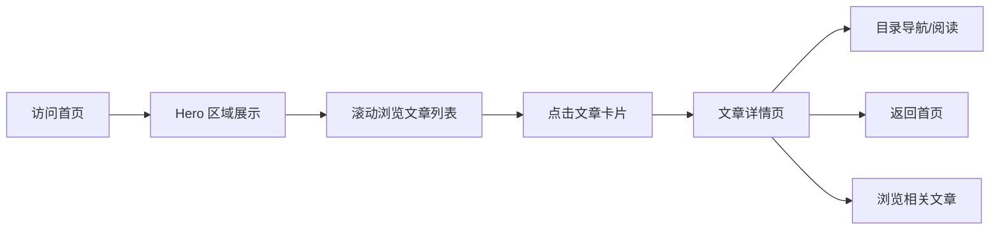

## 1. 产品概述

个人博客网站，以极简编辑风格呈现，专注于内容本身的表达。首页以大字体标语营造视觉冲击，辅以清晰的导航引导用户探索文章。面向技术与生活内容创作，追求阅读体验与视觉美感的平衡。

## 2. 核心功能

### 2.1 功能模块

1. **首页**：导航栏、Hero 大标题区域、最新文章列表、页脚
2. **文章列表页**：文章卡片网格、分类/标签筛选
3. **文章详情页**：Markdown 渲染、文章信息、目录导航
4. **关于页面**：个人介绍、社交链接

### 2.2 页面详情

| 页面名称 | 模块名称 | 功能描述 |
|---------|---------|---------|
| 首页 | 导航栏 | Logo、菜单链接（首页/文章/关于）、滚动时背景变化 |
| 首页 | Hero 区域 | 超大字体标语、副标题、渐入动画 |
| 首页 | 文章列表 | 最新文章卡片、阅读时间、标签 |
| 首页 | 页脚 | 版权信息、社交链接 |
| 文章列表页 | 筛选栏 | 分类标签、搜索框 |
| 文章列表页 | 文章网格 | 响应式卡片布局 |
| 文章详情页 | 文章头部 | 标题、日期、阅读时间、标签 |
| 文章详情页 | 正文内容 | MDX 渲染、代码高亮、图片优化 |
| 文章详情页 | 目录导航 | 滚动跟随、当前章节高亮 |
| 关于页面 | 个人介绍 | 头像、简介、技能标签 |
| 关于页面 | 时间线 | 经历时间轴 |

## 3. 核心流程

用户访问首页 → 浏览 Hero 区域 → 滚动查看最新文章 → 点击文章进入详情页 → 阅读文章/通过目录跳转 → 返回首页或浏览更多文章

## 4. 界面设计

### 4.1 设计风格

**编辑杂志风（Editorial）— 极简而有力量**

- **主色调**：米白背景（#F7F5F0），深墨文字（#1A1A1A），单一强调色（琥珀橙 #D97706）
- **字体**：标题使用衬线字体（Playfair Display / Noto Serif SC），正文使用无衬线字体（Inter / 思源黑体）
- **排版**：大字号标题，宽松行距，大量留白，强调阅读节奏感
- **按钮风格**：极简文字链接，下划线动画，无实心按钮
- **布局**：单栏聚焦式布局，居中内容区，最大宽度约束
- **图标风格**：细线条 SVG，简洁克制

### 4.2 页面设计概览

| 页面名称 | 模块名称 | UI 元素 |
|---------|---------|---------|
| 首页 | 导航栏 | 透明背景，滚动后加毛玻璃效果，文字链接悬停下划线 |
| 首页 | Hero 区域 | 超大衬线字体标题（clamp 响应式），逐字渐入动画，微妙的文字渐变 |
| 首页 | 文章列表 | 左对齐卡片，日期与标题错落排版，悬停时微上移动效 |
| 首页 | 页脚 | 细分隔线，小字版权，社交图标 |
| 文章详情页 | 正文 | 舒适行高（1.8），首字下沉效果，引用块特殊样式 |
| 文章详情页 | 目录 | 右侧固定，细线指示当前章节，滚动吸附 |

### 4.3 响应式

- 桌面端（1024px+）：最大内容宽度 720px，目录侧边栏
- 平板（768px-1024px）：内容宽度自适应，目录收起为顶部锚点
- 移动端（<768px）：汉堡菜单，单列布局，字体大小适配

### 4.4 动效设计

- 页面加载：标题逐字淡入，内容从上到下依次显现
- 滚动：导航栏背景渐变出现，文章卡片视差微移
- 悬停：链接下划线延展，卡片轻微上浮 + 阴影加深
- 文章页：目录滚动时平滑高亮切换
