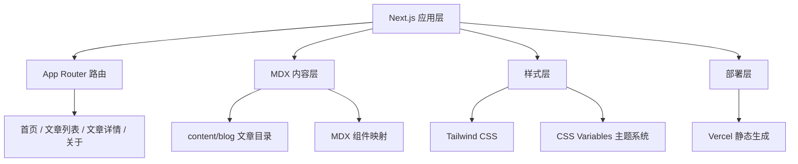

## 1. 架构设计



## 2. 技术选型

- **前端框架**：Next.js 14 (App Router) + React 18
- **内容管理**：MDX (Markdown + React 组件)
- **样式方案**：Tailwind CSS 3
- **字体方案**：next/font 谷歌字体优化
- **代码高亮**：shiki / rehype-pretty-code
- **Markdown 处理**：gray-matter + next-mdx-remote
- **部署平台**：Vercel

## 3. 目录结构

```
.
├── app/
│   ├── layout.tsx          # 根布局
│   ├── page.tsx            # 首页
│   ├── blog/
│   │   ├── page.tsx        # 文章列表
│   │   └── [slug]/
│   │       └── page.tsx    # 文章详情
│   └── about/
│       └── page.tsx        # 关于页
├── components/
│   ├── Navbar.tsx          # 导航栏
│   ├── Hero.tsx            # 首页 Hero 区域
│   ├── PostCard.tsx        # 文章卡片
│   ├── PostList.tsx        # 文章列表
│   ├── MDXComponents.tsx   # MDX 自定义组件
│   ├── TableOfContents.tsx # 目录导航
│   └── Footer.tsx          # 页脚
├── content/
│   └── blog/               # MDX 文章文件
│       ├── hello-world.mdx
│       └── ...
├── lib/
│   ├── posts.ts            # 文章读取工具函数
│   └── utils.ts            # 工具函数
├── public/
│   └── images/             # 静态图片
├── tailwind.config.ts
├── next.config.mjs
└── package.json
```

## 4. 路由定义

| 路由 | 用途 |
|------|------|
| `/` | 首页（Hero + 最新文章） |
| `/blog` | 文章列表页 |
| `/blog/[slug]` | 文章详情页 |
| `/about` | 关于页面 |

## 5. 数据模型

### 5.1 文章元数据 (Frontmatter)

```typescript
interface PostMeta {
  slug: string;        // 文章唯一标识
  title: string;       // 标题
  date: string;        // 发布日期 ISO 格式
  description: string; // 描述摘要
  tags: string[];      // 标签数组
  readingTime: number; // 阅读时间（分钟）
  cover?: string;      // 封面图
}
```

### 5.2 文章内容结构

每篇 MDX 文章包含：
- YAML Frontmatter（元数据）
- MDX 正文内容
- 支持嵌入自定义 React 组件

## 6. 关键技术点

1. **静态生成 (SSG)**：所有页面在构建时生成，确保最佳性能和 SEO
2. **Incremental Static Regeneration**：可配置 ISR 实现无需重新部署的内容更新
3. **MDX 组件映射**：自定义 Markdown 元素渲染，如代码块、引用、图片
4. **暗色主题**：基于 CSS Variables 的主题切换（后续可扩展）
5. **图片优化**：next/image 自动优化文章图片
6. **SEO**：next/head / generateMetadata 配置每页元信息
